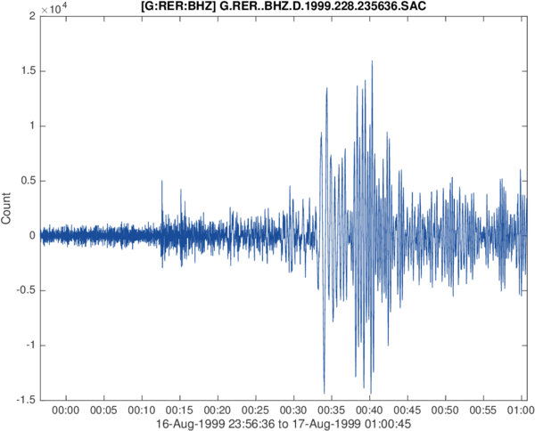

# sac-matlab

## rdsac.m
RDSAC reads a seismic data file encoded in the IRIS/SAC binary format, and returns a time vector, a data vector and all header variables in a structure (field names correspond to exact IRIS variable names).

## mksac.m
MKSAC writes a seismic data file in the IRIS/SAC binary standard format, from any data vector, origin time, and header field that user wants to define.

## Author
**François Beauducel**, [IPGP](www.ipgp.fr), [beaudu](https://github.com/beaudu), beauducel@ipgp.fr 

## Documentation
See functions documentation for detailed syntax and examples.

## Other repository

Functions are also available at MathWorks File Exchange: 
 with user comments and ratings.
